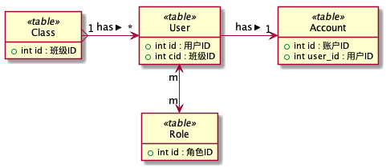

ORM(Object Relational Mapping)对象关系映射，对象间的关系无外乎:

1. 1对1，夫妻关系(一夫一妻制)。
2. 1对多/多对1，一个男人娶多个小妾(一夫一妻多妾)。
3. 多对多，不好举例子啊。

通过[模型](model.html)可以很方便地实现简单的ORM。

本文档将详细讲解下图(ER图，实体关系图)所示的关系:



上图表明的关系:

1. 一个学生(User)只有一个账号(Account):[一对一关系](#一对一关系)
2. 一个班级(Class)可以有多少学生(User),一个学生只能属于一个班级:[一对多关系](#一对多关系)
3. 一个学生(User)可以有多个角色(Role),一个角色可以属于多少学生(难道是班长大家一起干?):[多对多关系](#多对多关系)

<p class="tip">
为了演示之目的，下文的代码全部写在脚本里(在其中定义模型)，通过命令行执行并查看结果。
开始之前请保证你能正确连接数据库，并按步骤创建表与添加测试数据。
</p>

## 一对一关系

通过View类的`hasOne`和`belongsTo`方法定义。

一个用户有一个余额账户，一个余额账户只有属于一个人，一对一关系在设计表时可以有多种设计方案，本示例中使用的方案如下:

```sql
-- ------
-- 用户
-- ------
CREATE TABLE `user` (
    `id` INT UNSIGNED NOT NULL AUTO_INCREMENT COMMENT '用户ID',
    `username` VARCHAR(32) NOT NULL COMMENT '用户名',
    `nickname` VARCHAR(32) NULL COMMENT '昵称',
    `phone` VARCHAR(16) NULL COMMENT '手机号',
    `email` VARCHAR(128) NULL COMMENT '邮箱地址',
    `status` SMALLINT UNSIGNED NOT NULL DEFAULT 1 COMMENT '1正常,0禁用,2密码过期',
    `hash` VARCHAR(255) NOT NULL COMMENT '密码HASH',
    PRIMARY KEY (`id`),
    UNIQUE INDEX `UDX_USERNAME` (`username` ASC),
    INDEX `IDX_STATUS` (`status` ASC)
)  ENGINE=INNODB DEFAULT CHARACTER SET=UTF8 COMMENT='用户表';

-- -------
-- 用户账户
-- -------
CREATE TABLE `account` (
    `id` INT UNSIGNED NOT NULL AUTO_INCREMENT,
    `user_id` INT UNSIGNED NOT NULL COMMENT '用户ID',
    `amount` INT UNSIGNED NOT NULL DEFAULT 0 COMMENT '用户余额',
    PRIMARY KEY (`id`)
) ENGINE=InnoDB DEFAULT CHARACTER SET=UTF8 COMMENT '用户账户';
```

本方案中`user`与`account`表通过字段`user_id`进行关联。请通过下边代码添加一些测试数据:

```sql
INSERT INTO
        `user`(`username`,`nickname`,`phone`,`email`,`hash`)
    VALUES
        ('user1','张三','13888888888','admin@abc.com',MD5('123321')),
        ('user2','李四','13988888888','admin@def.com',MD5('123321')),
        ('user3','王二','13788888888','admin@ghi.com',MD5('123321')),
        ('user4','韩梅梅','13688888888','admin@jkl.com',MD5('123321')),
        ('user5','李雷','13588888888','admin@mno.com',MD5('123321'));

insert into account(user_id,amount) values (1,1000),(2,2000);
```

### 用户有一账户

在`wwwroot`目录创建文件`orm.php`(仅限演示)并添加`UserTable`:

```php
<?php
define('WWWROOT', __DIR__ . DIRECTORY_SEPARATOR);
include WWWROOT . '../bootstrap.php';

class UserTable extends \wulaphp\db\Table {
    public function account() {
        return $this->hasOne('account', 'user_id', 'id');
    }
}
```

通过`hasOne`方法声明用户**有一个**账户。`hasOne`方法声明如下:

```php
/**
 * one-to-one.
 *
 * @param View|string $tableCls
 * @param string      $foreign_key 值字段在$tableCls中的引用.
 * @param string      $value_key   值字段，默认为本表主键.
 *
 * @return array
 */
protected final function hasOne($tableCls, $foreign_key = '', $value_key = '')
```

**参数说明:**

1. `$tableCls`:拥有的实体表，可以是表名也可以是模型类实例.
2. `$foreign_key`:拥有的实体表中与当前表关联的字段名.
    * 默认的字段名格式是"表名_id", 此例中如果不提供则使用`user_id`。
3. `$value_key`:本实例表中的主键或唯一键，与`$foreign_key`关联。
    * 默认字段名是`id`.

### 账户属于一个用户

在`orm.php`中添加`AccountTable`:

```php
class AccountTable extends \wulaphp\db\Table {
    public function user() {
        return return $this->belongsTo('user','user_id');
    }
}
```

通过`belongsTo`方法声明账户**属于一个**用户。`belongsTo`方法声明如下:

```php
/**
 * one-to-one and one-to-many inverse
 *
 *
 * @param View|string $tableCls
 * @param string      $value_key   值字段(本表通过此字段属于$tableCls),默认为$tableCls_id.
 * @param string      $foreign_key $tableCls的主键或唯一键.
 *
 * @return array
 */
protected final function belongsTo($tableCls, $value_key = '', $foreign_key = '')
```

**参数说明:**

1. `$tableCls`: 属于实体表，可以是表名也可以是模型类实例.
2. `$value_key`: 本实体表中通过此字段与「属于实体」表进行关联.
    * 默认的字段名格式是"属于实体表名_id",此例中如果不提供则使用`class_id`.
3. `$foreign_key`: 属于实体表中与此实体关联的字段。
    * 默认是`id`.

### 使用

表结构有了，代码有了，跑起来，跑起来。。。
在`orm.php`中添加演示代码:

```php
$userTable = new UserTable();
$user      = $userTable->get(1);
$amount    = $user['account']['amount'];

echo "amount:", $amount, ", \n";

$accountTable = new AccountTable();
$account      = $accountTable->get(1);
$username     = $account['user']['username'];

echo "username:", $username, ", \n";
```

命令行运行`php orm.php`或浏览器访问`orm.php`，结果如你所见。
在循环中使用演示代码(可以把之前的演示代码注释掉):

```php
$userTable = new UserTable();
$users     = $userTable->find(['id @' => [1, 2]]);

foreach ($users as $user) {
    echo 'username:', $user['username'], ', amount:', $user['account']['amount'], ", \n";
}
```

> **注意**`$user`是Query实例，为了使用ORM机制不能将其转换为结果数组。

## 一对多关系

也可以叫『多对一关系』。通过View类的`hasMany`和`belongsTo`方法定义。

**关系描述:**

一个班级有多个学生(用户)，一个学生(用户)只能属于一个班级。奉上SQL:

```sql
-- 修改学生表添加cid字段
ALTER TABLE user
ADD COLUMN cid INT UNSIGNED NOT NULL DEFAULT 0 COMMENT '班级编号';
-- 班级表
CREATE TABLE `classes` (
    `id` INT(11) NOT NULL AUTO_INCREMENT,
    `name` VARCHAR(45) NOT NULL COMMENT '班级名称',
    `master` VARCHAR(45) DEFAULT NULL COMMENT '班主任',
    PRIMARY KEY (`id`)
)  ENGINE=INNODB DEFAULT CHARSET=UTF8;
-- 添加2个班级
INSERT INTO classes VALUES (id,name,master) VALUES
    (1,'小一班','小张'),(2,'小二班','小王');

-- 将编号为1，2的用户班级修改为"小一班"
UPDATE user SET cid = 1 WHERE id IN (1,2);

-- 将编号为3，4，5的用户班级修改为"小二班"
UPDATE user SET cid = 2 WHERE id IN (3,4,5);
```

### 属于一个班级

在orm.php中的`UserTable`类中添加以下方法:

```php
public function myclass() {
    return return $this->belongsTo('classes', 'cid');
}
```

通过`belongsTo`方法声明用户**属于一个**班级。

### 有多个学生

在orm.php中添加`ClassesTable`:

```php
class ClassesTable extends \wulaphp\db\Table {
    public function students() {
        return $this->hasMany('user', 'cid', 'id');
    }
}
```

通过`hasMany`方法定义一个班级**拥有**多个学生。`hasMany`方法声明如下:

```php
/**
 * one-to-many.
 *
 * @param View|string $tableCls
 * @param string      $foreign_key 字段在$tableCls中的引用.
 * @param string      $value_key   关联字段，默认为本表主键.
 *
 * @return array
 */
protected final function hasMany($tableCls, $foreign_key = '', $value_key = '')
```

参数说明:

1. `$tableCls`:拥有的实体表，可以是表名也可以是模型类实例.
2. `$foreign_key`:拥有的实体表中与当前表关联的字段名.
    * 默认的字段名格式是"表名_id", 此例中如果不提供则使用`class_id`。
3. `$value_key`:本实例表中的主键或唯一键，与`$foreign_key`关联。
    * 默认字段名是`id`.

### 一对多演示

代码有了，数据有了，跑起来，跑起来。。。

在`orm.php`中添加演示代码(可以把其它演示代码注释掉):

1. 取用户班级信息.
    ```php
    $userTable = new UserTable();
    $users     = $userTable->find(['id @' => [1, 3]]);

    foreach ($users as $user) {
        echo 'username:', $user['username'], ', classname:', $user['myclass']['name'], ", \n";
    }
    ```
2. 获取班级与学生列表
    ```php
    $clsTable = new ClassesTable();
    $clses    = $clsTable->find(['id @' => [1, 2]]);
    foreach ($clses as $cls) {
        echo 'className:', $cls['name'], "\n";
        foreach ($cls['students'] as $student) {
            echo ' student:', $student['username'], "\n";
        }
    }
    ```
3. 再来一波骚操作，获取班级中按姓名排序后的前2名学生。
    ```php
    $clsTable = new ClassesTable();
    $clses    = $clsTable->find(['id @' => [1, 2]]);
    foreach ($clses as $cls) {
        echo 'className:', $cls['name'], "\n";
        foreach ($cls->students()->asc('username')->limit(0, 2) as $student) {
            echo ' student:', $student['username'], "\n";
        }
    }
    ```
4. 通过`with`加载用户班级信息(myclass)
    ```php
    $userTable = new UserTable();
    $users     = $userTable->find(['id @' => [1, 2, 3, 4, 5]])->with('myclass');

    foreach ($users as $user) {
        echo 'username:', $user['username'], ', classname:', $user['myclass']['name'], ", \n";
    }
    echo "sql count:",\wulaphp\db\sql\Query::getSqlCount(), "\n";
    ```

> **注意**
>
> 1. `students`调用将返回一个Query实例。可以通过此实例进行排序，分页，添加等处理。
> 2. 可以注释`->with('myclass')`看看执行的SQL数量的变化。
> 3. `with`只能用于`belongsTo`定义的字段。

## 多对多关系

通过View类的`belongsToMany`方法定义。

**关系描述:**
一个用户可以有多个角色，一个角色可以有多个用户.

1. `UserTable`的`roles`字段声明:
    ```php
    public function roles() {
        return $this->belongsToMany('roles', 'user_roles', 'user_id', 'role_id');
    }
    ```
1. `RoleTable`的`users`字段声明:
    ```php
    public function users() {
        return $this->belongsToMany('users', 'user_roles', 'role_id', 'user_id');
    }
    ```

`belongsToMany`声明如下:

```php
/**
 * many-to-many(只能是主键相关).
 *
 * @param View|string  $tableCls
 * @param string       $mtable     中间表名
 * @param string|array $value_keys 当前表在$mtable中的外键（本表主键）.
 * @param string|array $table_keys $tableCls在$mtable中的外键($table的主键).
 *
 * @return array|null
 */
protected final function belongsToMany($tableCls, $mtable = '', $value_keys = '', $table_keys = '') {
```

**特别说明**当表的主键是不`id`时`$value_keys`或`$table_keys`需要通过数组方式传主键和$mtable中的关联键。如`user`表的主键是uid时,UserTable中`roles`字段声明代码如下:

```php
protected $primaryKeys = ['uid'];

public function roles() {
    return $this->belongsToMany('roles', 'user_roles', ['uid', 'user_id'], 'role_id');
}
```

> 思考题，如果roles表的主键是`id`呢？
