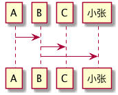


知其然，知其所以然。


## 流程图

掌握wulaphp的工作流程对驾御她有着极大的帮助。下图为wulaphp核心工作流程:



从上图可以看出核心流程分**框架初始化**与**业务处理**两阶段，而业务处理又分三种具体应用:

1. [URL请求处理](#URL请求处理)，就是常见的页面访问处理。
2. [命令行脚本](#命令行脚本)，处理日常任务的脚本文件。
3. [基于artisan命令行](#artisan)的命令。

## 框架初始化

wulaphp通过`bootstrap.php`文件经过以下步骤将自己拉起来:

1. 定义目录，常量，公用函数，类懒加载，错误处理，缓冲区管理等等
2. 加载公用类库
3. 加载配置
4. 加载扩展
5. 加载模块

经过以上5步，wulaphp就初始化完成了。接下来的流程就视具体情况而定了。

## URL请求处理

路由器将请求分发给不同的分发器处理，系统默认提供了2个分发器:

1. `MVC`分发器(默认分发器)，将URL按**所见即所得**规则分发给模块的控制器处理。
2. 路由表分发器，根据用户定义的路由表分发请求。

如果上述分发器分发请求失败，则路由器会将请求分发给用户[自定义分发器](#a)处理。

## 命令行脚本

很多时候你需要写几个脚本来做一些事情，这时你只需要在你的脚本头部引用`bootstrap.php`文件即可享用wulaphp框架：

```php
include 'bootstrap.php';
```

> 唯一注意一点，不管你的脚本文件在哪个目录请保证能正确`include`到`bootstrap.php`文件.

## artisan

`artisan`是wulaphp提供的命令行工具，通过`php artisan`或`./artisan`即可执行。同时可以很方便的通过插件机制实现自己的命令,具体见[实现自己的命令](#cmd)。

<p class="tip">
任何问题，欢迎加QQ群找群主:<a target="_blank" href="http://shang.qq.com/wpa/qunwpa?idkey=9be37f660c70dd33c22f6055cd113215a52e9cab29d46b5c02fe2f68c67a0f17">371487281</a>
</p>